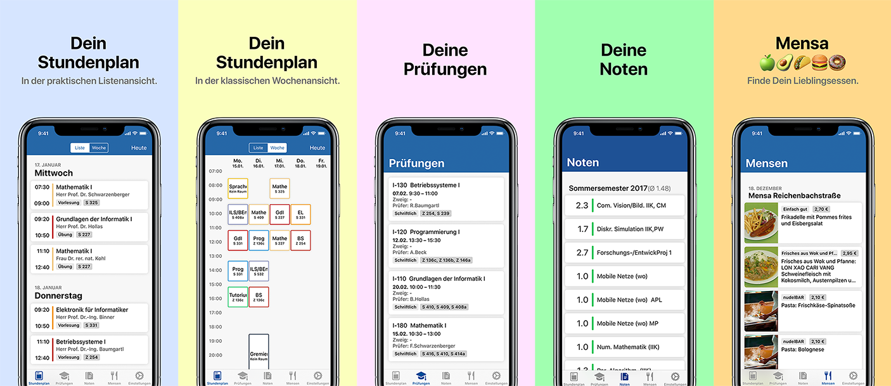

# HTW Dresden iOS App

## Important Note:
**This open-source project is no longer maintained. The "HTW Dresden" app you can currently find on the App Store is a closed-source fork of this project that has not been created by the original authors.**

---

[](https://github.com/HTWDD/htwcampus/blob/develop/LICENSE)
[](https://github.com/HTWDD/htwcampus)
[](http://appstore.com/htwdresden)
[](https://travis-ci.org/HTWDD/htwcampus)




---

## Getting started
1. [Download](https://developer.apple.com/xcode/download/) the latest Xcode release.
2. Clone this repository.
3. If you haven't already, install [Carthage](https://github.com/Carthage/Carthage).
4. Run `carthage bootstrap --platform iOS` from the command line to clone and build dependencies.

## About
The 'HTW Dresden iOS App' is a student-initiated project that enables students of the [University of Applied Sciences Dresden](https://www.htw-dresden.de/en/home.html) to access their schedule, audit plan, grades and more easily.

## Questions
If you have questions about any aspect of this project, please feel free to [open an issue](https://github.com/HTWDD/htwcampus/issues/new). We'd love to hear from you!

## License
This project is licensed under the [MIT](https://github.com/HTWDD/htwcampus/blob/develop/LICENSE) license.

```
MIT License

Copyright (c) 2016-2018 HTW Dresden Apps

Permission is hereby granted, free of charge, to any person obtaining a copy
of this software and associated documentation files (the "Software"), to deal
in the Software without restriction, including without limitation the rights
to use, copy, modify, merge, publish, distribute, sublicense, and/or sell
copies of the Software, and to permit persons to whom the Software is
furnished to do so, subject to the following conditions:

The above copyright notice and this permission notice shall be included in all
copies or substantial portions of the Software.

THE SOFTWARE IS PROVIDED "AS IS", WITHOUT WARRANTY OF ANY KIND, EXPRESS OR
IMPLIED, INCLUDING BUT NOT LIMITED TO THE WARRANTIES OF MERCHANTABILITY,
FITNESS FOR A PARTICULAR PURPOSE AND NONINFRINGEMENT. IN NO EVENT SHALL THE
AUTHORS OR COPYRIGHT HOLDERS BE LIABLE FOR ANY CLAIM, DAMAGES OR OTHER
LIABILITY, WHETHER IN AN ACTION OF CONTRACT, TORT OR OTHERWISE, ARISING FROM,
OUT OF OR IN CONNECTION WITH THE SOFTWARE OR THE USE OR OTHER DEALINGS IN THE
SOFTWARE.
```